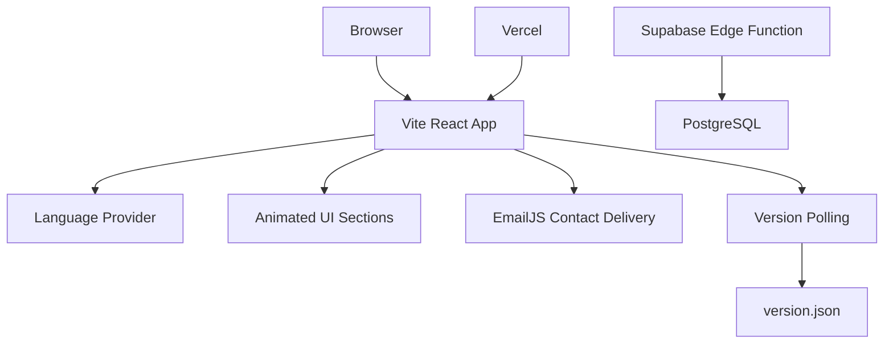

# emot

> A sharp, bilingual portfolio for building high-performance web products, cloud systems, and data-driven experiences.


<p align="center">
	
	
	
	
</p>

<p align="center">
	
	
	
	
</p>

<p align="center">
	<strong>Engineer. Architect. Founder.</strong><br />
	<sub>Modern interfaces, scalable systems, and engineering that feels as good as it performs.</sub>
</p>

<p align="center">
	<a href="https://github.com/ahmedamrosman54/emot">Source Code</a>
	&nbsp;&bull;&nbsp;
	<a href="https://emot.dev/">Live Website</a>
</p>

<p align="center">
	<a href="https://emot.dev/"></a>
	<a href="https://wa.me/201012266400"></a>
</p>

## نبذة بالعربي

موقع `emot` هو Portfolio احترافي ثنائي اللغة لعرض الخدمات التقنية والمشاريع المختارة. التصميم متجاوب، سريع، ويدعم العربية مع اتجاه RTL، بالإضافة إلى تجربة بصرية مستوحاة من الأنظمة السحابية والبيانات الحديثة.

<p align="center">
	
	
	
</p>

## What is emot?

`emot` is a polished portfolio experience for Ahmed Amr, focused on presenting technical services and selected work with a fast, immersive interface.

The website includes:

- Bilingual English and Arabic UI with automatic RTL support.
- Responsive layout for phones, tablets, and desktop screens.
- Animated hero section, aurora background, starfield, and scroll reveals.
- Services, portfolio, pricing, testimonials, and contact sections.
- WhatsApp, phone, email, and EmailJS contact actions.
- SEO metadata, Open Graph tags, canonical URL, and structured data.
- Automatic deployment update detection for long-open browser tabs.
- Vercel cache headers for the deployment version marker.

## Visual Direction

The interface uses a dark space-inspired canvas, electric cyan, mint green, and crimson accents, glass surfaces, subtle grid lines, animated reveals, and a custom Mac-style pointer for desktop users.

<p align="center">
	
	
</p>

## Sections

| Section      | Purpose                                                         |
| ------------ | --------------------------------------------------------------- |
| Hero         | Brand statement, calls to action, and key numbers               |
| About        | Founder story, capabilities, technology badges, and stats       |
| Services     | Digital design, databases, frontend performance, and dashboards |
| Portfolio    | Selected projects with responsive project cards                 |
| Pricing      | Standard, Premium, Ultra, and storage add-ons                   |
| Testimonials | Responsive client review slider                                 |
| Contact      | EmailJS form plus direct WhatsApp, phone, and email actions     |

## Architecture



## Design principles

- **Clear hierarchy:** the first screen communicates who builds what and how to start.
- **Useful motion:** animation supports discovery and depth without blocking the content.
- **Responsive by default:** grids, typography, navigation, and interactions adapt to the viewport.
- **Bilingual at the foundation:** language and direction are managed through one shared context.
- **Performance aware:** lazy-loaded sections, optimized canvas behavior, and cache-aware deployment updates.
- **Accessible actions:** buttons, links, labels, alternative text, and keyboard-friendly form controls are included.

## Technology Stack

| Area               | Tools                               |
| ------------------ | ----------------------------------- |
| Frontend           | React, TypeScript, Vite             |
| Styling            | Tailwind CSS, PostCSS               |
| Motion             | Framer Motion                       |
| Icons              | Lucide React                        |
| Contact delivery   | EmailJS                             |
| Backend foundation | Supabase Edge Functions, PostgreSQL |
| Deployment         | Vercel                              |

## Tech showcased

React &nbsp;•&nbsp; TypeScript &nbsp;•&nbsp; Supabase &nbsp;•&nbsp; PostgreSQL &nbsp;•&nbsp; Node.js &nbsp;•&nbsp; Cloud &nbsp;•&nbsp; Docker &nbsp;•&nbsp; ES6 &nbsp;•&nbsp; Tailwind CSS &nbsp;•&nbsp; Angular.js &nbsp;•&nbsp; MongoDB &nbsp;•&nbsp; NestJS &nbsp;•&nbsp; Express.js &nbsp;•&nbsp; Python &nbsp;•&nbsp; AI

<p align="center">
	
</p>

## Run locally

### Requirements

- Node.js 18+
- npm

### Installation

```bash
git clone https://github.com/ahmedamrosman54/emot.git
cd emot
npm install
npm run dev
```

Vite will print the local development URL in the terminal, usually `http://localhost:5173`.

### Development checklist

```bash
npm run typecheck
npm run lint
npm run build
npm run preview
```

Before opening a pull request, verify both language directions, mobile navigation, contact validation, external links, image loading, and the production preview.

## Environment variables

Create a `.env` file in the project root for the contact form:

```env
VITE_EMAILJS_SERVICE_ID=service_xxxxxxx
VITE_EMAILJS_TEMPLATE_ID=template_xxxxxxx
VITE_EMAILJS_PUBLIC_KEY=xxxxxxxxxxxxxxx
```

The EmailJS template should accept these variables:

```text
{{from_name}}
{{reply_to}}
{{message}}
{{to_email}}
```

Restart the Vite server after changing `.env`. Never commit `.env` or private service credentials.

## Production commands

```bash
npm run build       # Generate the deployment version and production bundle
npm run preview     # Preview the production bundle locally
npm run typecheck   # Run TypeScript validation
npm run lint        # Run ESLint
```

## Deploy to Vercel

1. Import the GitHub repository into Vercel.
2. Keep the framework preset as **Vite**.
3. Set the required EmailJS environment variables in Vercel.
4. Deploy the `main` branch.

Every push to `main` triggers a new deployment. The build also generates `public/version.json`; open tabs check this marker periodically and refresh when a newer deployment is available.

### Deployment flow

```text
Local change -> git push origin main -> Vercel build -> production deploy -> open tabs detect version change
```

No manual server restart is required after a successful Vercel deployment.

## Project structure

```text
src/
├── components/      Reusable page sections and visual effects
├── i18n/            Language context and English/Arabic translations
├── App.tsx          Application composition and deployment update check
└── main.tsx         React entry point

public/              Static assets and deployment version marker
supabase/
├── functions/       Edge Functions
└── migrations/      PostgreSQL migrations
```

## Contact

Built by **Ahmed Amr**.

- GitHub: [ahmedamrosman54](https://github.com/ahmedamrosman54)
- Website: [emot.dev](https://emot.dev/)
- Email: [ahmoziaham@gmail.com](mailto:ahmoziaham@gmail.com)
- WhatsApp: [Chat on WhatsApp](https://wa.me/201012266400)

## License

This project is private and intended for the `emot` portfolio. Contact the owner before reusing its content, branding, or assets.

<p align="center">
	
</p>
