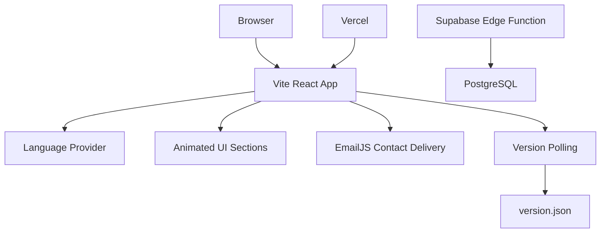

# emot

> A sharp, bilingual portfolio for building high-performance web products, cloud systems, and data-driven experiences.


<p align="center">
	
	
	
	
</p>

<p align="center">
	
	
	
	
</p>

<p align="center">
	<strong>Engineer. Architect. Founder.</strong><br />
	<sub>Modern interfaces, scalable systems, and engineering that feels as good as it performs.</sub>
</p>

<p align="center">
	<a href="https://github.com/ahmedamrosman54/emot">Source Code</a>
	&nbsp;&bull;&nbsp;
	<a href="https://emot.dev/">Live Website</a>
</p>

<p align="center">
	<a href="https://emot.dev/"></a>
	<a href="https://wa.me/201012266400"></a>
</p>

## نبذة بالعربي

موقع `emot` هو Portfolio احترافي ثنائي اللغة لعرض الخدمات التقنية والمشاريع المختارة. التصميم متجاوب، سريع، ويدعم العربية مع اتجاه RTL، بالإضافة إلى تجربة بصرية مستوحاة من الأنظمة السحابية والبيانات الحديثة.

<p align="center">
	
	
	
</p>

## What is emot?

`emot` is a polished portfolio experience for Ahmed Amr, focused on presenting technical services and selected work with a fast, immersive interface.

The website includes:

- Bilingual English and Arabic UI with automatic RTL support.
- Responsive layout for phones, tablets, and desktop screens.
- Animated hero section, aurora background, starfield, and scroll reveals.
- Services, portfolio, pricing, testimonials, and contact sections.
- WhatsApp, phone, email, and EmailJS contact actions.
- SEO metadata, Open Graph tags, canonical URL, and structured data.
- Automatic deployment update detection for long-open browser tabs.
- Vercel cache headers for the deployment version marker.

## Visual Direction

The interface uses a dark space-inspired canvas, electric cyan, mint green, and crimson accents, glass surfaces, subtle grid lines, animated reveals, and a custom Mac-style pointer for desktop users.

<p align="center">
	
	
</p>

## Sections

| Section      | Purpose                                                         |
| ------------ | --------------------------------------------------------------- |
| Hero         | Brand statement, calls to action, and key numbers               |
| About        | Founder story, capabilities, technology badges, and stats       |
| Services     | Digital design, databases, frontend performance, and dashboards |
| Portfolio    | Selected projects with responsive project cards                 |
| Pricing      | Standard, Premium, Ultra, and storage add-ons                   |
| Testimonials | Responsive client review slider                                 |
| Contact      | EmailJS form plus direct WhatsApp, phone, and email actions     |

## Architecture



## Design principles

- **Clear hierarchy:** the first screen communicates who builds what and how to start.
- **Useful motion:** animation supports discovery and depth without blocking the content.
- **Responsive by default:** grids, typography, navigation, and interactions adapt to the viewport.
- **Bilingual at the foundation:** language and direction are managed through one shared context.
- **Performance aware:** lazy-loaded sections, optimized canvas behavior, and cache-aware deployment updates.
- **Accessible actions:** buttons, links, labels, alternative text, and keyboard-friendly form controls are included.

## Technology Stack

| Area               | Tools                               |
| ------------------ | ----------------------------------- |
| Frontend           | React, TypeScript, Vite             |
| Styling            | Tailwind CSS, PostCSS               |
| Motion             | Framer Motion                       |
| Icons              | Lucide React                        |
| Contact delivery   | EmailJS                             |
| Backend foundation | Supabase Edge Functions, PostgreSQL |
| Deployment         | Vercel                              |

## Tech showcased

React &nbsp;•&nbsp; TypeScript &nbsp;•&nbsp; Supabase &nbsp;•&nbsp; PostgreSQL &nbsp;•&nbsp; Node.js &nbsp;•&nbsp; Cloud &nbsp;•&nbsp; Docker &nbsp;•&nbsp; ES6 &nbsp;•&nbsp; Tailwind CSS &nbsp;•&nbsp; Angular.js &nbsp;•&nbsp; MongoDB &nbsp;•&nbsp; NestJS &nbsp;•&nbsp; Express.js &nbsp;•&nbsp; Python &nbsp;•&nbsp; AI

<p align="center">
	
</p>

## Run locally

### Requirements

- Node.js 18+
- npm

### Installation

```bash
git clone https://github.com/ahmedamrosman54/emot.git
cd emot
npm install
npm run dev
```

Vite will print the local development URL in the terminal, usually `http://localhost:5173`.

### Development checklist

```bash
npm run typecheck
npm run lint
npm run build
npm run preview
```

Before opening a pull request, verify both language directions, mobile navigation, contact validation, external links, image loading, and the production preview.

## Environment variables

Create a `.env` file in the project root for the contact form:

```env
VITE_EMAILJS_SERVICE_ID=service_xxxxxxx
VITE_EMAILJS_TEMPLATE_ID=template_xxxxxxx
VITE_EMAILJS_PUBLIC_KEY=xxxxxxxxxxxxxxx
```

The EmailJS template should accept these variables:

```text
{{from_name}}
{{reply_to}}
{{message}}
{{to_email}}
```

Restart the Vite server after changing `.env`. Never commit `.env` or private service credentials.

## Production commands

```bash
npm run build       # Generate the deployment version and production bundle
npm run preview     # Preview the production bundle locally
npm run typecheck   # Run TypeScript validation
npm run lint        # Run ESLint
```

## Deploy to Vercel

1. Import the GitHub repository into Vercel.
2. Keep the framework preset as **Vite**.
3. Set the required EmailJS environment variables in Vercel.
4. Deploy the `main` branch.

Every push to `main` triggers a new deployment. The build also generates `public/version.json`; open tabs check this marker periodically and refresh when a newer deployment is available.

### Deployment flow

```text
Local change -> git push origin main -> Vercel build -> production deploy -> open tabs detect version change
```

No manual server restart is required after a successful Vercel deployment.

## Product tour

### Hero experience

The hero is the first signal of the product. It introduces the `emot` identity, explains the engineering focus, and gives visitors two direct paths:

- Start a conversation through WhatsApp.
- Jump directly to the selected work section.

The three headline numbers are intentionally compact so the visitor understands the scale of the work without leaving the first viewport.

### About experience

The About section combines a short founder narrative with a technical capability grid. Technology badges make the stack scannable, while the stats bar gives the section a measurable shape.

### Services experience

Services are grouped into four practical capabilities:

1. Digital interface design.
2. Database engineering.
3. High-speed frontend development.
4. Company dashboards and admin systems.

Each service card uses a different accent color and responds to pointer movement with a restrained 3D tilt effect.

### Portfolio experience

Portfolio cards use a responsive grid and lazy-loaded imagery. On large screens, the action appears on hover. On small screens, the action remains visible so the interface does not depend on hover.

### Pricing experience

The pricing section presents three levels and separate database storage add-ons. Every package has a direct call to action, keeping the path from comparison to contact short.

### Testimonials experience

Testimonials are displayed in a responsive slider:

- One card on phones.
- Two cards on medium screens.
- Three cards on large screens.
- Touch and mouse drag support.
- Automatic movement every five seconds.
- Previous, next, and position controls.

### Contact experience

The contact area offers several ways to start a project. Visitors can send a structured message through EmailJS or choose WhatsApp, phone, or email directly.

<p align="center">
	
	
	
</p>

## Content map

The visible copy is centralized in `src/i18n/translations.ts`. This keeps English and Arabic content together and makes language switching predictable.

| Content                        | File                                                             |
| ------------------------------ | ---------------------------------------------------------------- |
| Navigation labels              | `src/i18n/translations.ts`                                       |
| Hero copy and numbers          | `src/i18n/translations.ts` and `src/components/Hero.tsx`         |
| Founder story and capabilities | `src/i18n/translations.ts` and `src/components/About.tsx`        |
| Services copy                  | `src/i18n/translations.ts` and `src/components/Services.tsx`     |
| Project names and categories   | `src/i18n/translations.ts` and `src/components/Portfolio.tsx`    |
| Pricing and features           | `src/i18n/translations.ts` and `src/components/Pricing.tsx`      |
| Testimonials                   | `src/i18n/translations.ts` and `src/components/Testimonials.tsx` |
| Contact messages               | `src/i18n/translations.ts` and `src/components/Contact.tsx`      |
| Footer links                   | `src/i18n/translations.ts` and `src/components/Footer.tsx`       |

## Customize the portfolio

### Change the brand

Update the title, description, Open Graph values, and structured data in `index.html`. Keep the canonical URL aligned with the production domain.

Update the visual tokens in `src/index.css` when changing the brand palette:

```css
:root {
  --bg: #0b0f19;
  --cyber: #00d4ff;
  --crimson: #ff3b5c;
  --mint: #3aff9e;
}
```

### Add a portfolio project

1. Add the project title and category to both language objects in `src/i18n/translations.ts`.
2. Add the project entry to the `projects` array in `src/components/Portfolio.tsx`.
3. Add its image URL to `PROJECT_IMAGES` at the matching index.
4. Choose one of the existing accent keys: `cyber`, `mint`, or `crimson`.
5. Run `npm run typecheck` and `npm run build`.

Keep the project image order synchronized with the project array. The component uses the same index for the card content and image.

### Add a service

1. Add four translation keys to the English and Arabic objects.
2. Choose a Lucide icon in `src/components/Services.tsx`.
3. Add the service to the `services` array.
4. Keep the color type limited to the existing accent colors.
5. Check the card at phone, tablet, and desktop widths.

### Add a language

The current language type is intentionally small:

```ts
export type Language = "en" | "ar";
```

To add another language:

1. Extend the `Language` union.
2. Add a complete `Translation` object.
3. Add the language to the toggle validation in `LanguageContext.tsx`.
4. Add the direction and font rules in `src/index.css` if needed.
5. Test navigation, forms, slider controls, and long translated labels.

Do not add partial translations. The `Translation` type is the contract that keeps every visible section complete.

## EmailJS guide

The contact form sends messages from the browser through EmailJS. It requires three public configuration values:

| Variable                   | Meaning                           |
| -------------------------- | --------------------------------- |
| `VITE_EMAILJS_SERVICE_ID`  | EmailJS service identifier        |
| `VITE_EMAILJS_TEMPLATE_ID` | EmailJS email template identifier |
| `VITE_EMAILJS_PUBLIC_KEY`  | EmailJS browser public key        |

The configured template receives:

| Variable    | Form value            |
| ----------- | --------------------- |
| `from_name` | Visitor name          |
| `reply_to`  | Visitor email         |
| `message`   | Project details       |
| `to_email`  | Portfolio owner email |

Recommended EmailJS setup:

1. Create or select an email service.
2. Create a template with the four variables above.
3. Copy the service ID, template ID, and public key.
4. Add them to local `.env` for development.
5. Add the same values to Vercel project environment variables.
6. Redeploy after changing production variables.
7. Send a real test message from the deployed website.

The form validates required fields and email format before sending. It also includes a honeypot field to ignore basic automated submissions.

## Supabase foundation

The repository contains a Supabase Edge Function at `supabase/functions/contact-form/index.ts` and a PostgreSQL migration for `contact_messages`.

The function:

- Accepts `POST` requests.
- Handles CORS preflight requests.
- Validates name, email, and message.
- Limits names to 200 characters.
- Limits messages to 5000 characters.
- Inserts valid messages into PostgreSQL.
- Returns JSON responses with appropriate status codes.

The function expects server-side values named:

```env
SUPABASE_URL=https://your-project.supabase.co
SUPABASE_SERVICE_ROLE_KEY=your-server-only-key
```

Never expose `SUPABASE_SERVICE_ROLE_KEY` in a `VITE_` variable or frontend code. It belongs only in the Supabase function environment.

The current frontend contact flow uses EmailJS. The Supabase function is a backend foundation for a future database-backed contact workflow or an additional message archive.

## Performance notes

Performance work in this project focuses on reducing the cost of the first viewport and preserving responsiveness:

- Below-the-fold sections are loaded with React lazy imports.
- Portfolio images use lazy loading and asynchronous decoding.
- The starfield uses fewer particles on mobile devices.
- Mobile star rendering avoids expensive canvas glow effects.
- Hidden tabs do not keep the animation loop active.
- Reduced-motion preferences disable decorative animation.
- The deployment version marker avoids stale HTML/version cache behavior.
- The hero heading is visible immediately for a better LCP signal.

When running Lighthouse, use a fresh Incognito window and test the deployed URL. A local development server and a production deployment measure different JavaScript, network, and caching behavior.

### Performance review checklist

- Test with mobile throttling enabled.
- Test once with an empty cache.
- Test again with a warm cache.
- Record LCP, CLS, TBT, and Speed Index.
- Check the largest element in the LCP diagnostic.
- Confirm external images are not blocking the first viewport.
- Check that animations do not cause layout shifts.
- Compare the result after every significant visual change.

## Accessibility notes

The interface is designed around direct, recognizable actions:

- Navigation uses real links with section anchors.
- Form controls have visible labels.
- Images provide alternative text based on project titles.
- Decorative canvases are hidden from assistive technologies.
- Slider controls include accessible labels.
- External links use `rel="noopener noreferrer"` when opened in a new tab.
- Touch interactions complement, rather than replace, visible controls.
- The layout supports both LTR and RTL document directions.

When adding content, keep headings in a logical order, preserve visible focus states, and avoid communicating essential information only through color.

## Security notes

- `.env` is ignored by Git.
- EmailJS public keys are intended for browser use, but template and service permissions should still be restricted.
- Supabase service role credentials must remain server-side.
- User input is validated before EmailJS submission.
- The Supabase function validates input independently.
- External links use safe opener behavior.
- No secrets should be placed in README files, screenshots, commits, or issue descriptions.

## Troubleshooting

### The contact form does not send

Check that all three `VITE_EMAILJS_*` variables exist, the template variable names match exactly, and the dev server was restarted after editing `.env`.

### Arabic text is not aligned correctly

Switch the language from the navbar and inspect `document.documentElement.dir`. The language provider controls both `lang` and `dir` on the root HTML element.

### The website shows old content after deployment

Wait for the Vercel deployment to finish, then inspect the deployment URL. The application checks `version.json` periodically, but a browser or CDN may still hold an older page before the new deployment is ready.

### Images are missing

Confirm the image URL is reachable, the project index matches the image index, and the remote image host allows the request. Prefer stable, optimized images with a sensible width.

### The layout feels slow on mobile

Run a production build, disable extensions, test with throttling, and inspect canvas and image cost first. Avoid adding large images or continuous effects above the fold.

### Vercel uses the wrong project

Verify that the Vercel project is connected to `ahmedamrosman54/emot`, that the production branch is `main`, and that the build command is `npm run build`.

## Contribution workflow

For a focused change:

1. Create a branch from `main`.
2. Make the smallest related change.
3. Keep copy changes synchronized in English and Arabic.
4. Run typecheck, lint, and build.
5. Test the changed section at multiple widths.
6. Review the production preview.
7. Open a pull request with screenshots for visual changes.

Suggested commit prefixes:

```text
feat: add a portfolio section
fix: correct mobile spacing
perf: reduce canvas rendering cost
docs: improve setup instructions
chore: update dependencies
```

## Release checklist

- [ ] Content is correct in English.
- [ ] Content is correct in Arabic.
- [ ] RTL layout has been checked.
- [ ] Phone layout has been checked.
- [ ] Tablet layout has been checked.
- [ ] Desktop layout has been checked.
- [ ] Contact form has been tested.
- [ ] WhatsApp and email links have been tested.
- [ ] Images have useful alt text.
- [ ] No secret values are committed.
- [ ] `npm run typecheck` passes.
- [ ] `npm run lint` has no new errors.
- [ ] `npm run build` passes.
- [ ] Lighthouse has been run on production.
- [ ] Vercel deployment is connected to the intended repository.

## Roadmap

- Add a dedicated project detail route for each portfolio item.
- Add real project screenshots stored in the repository or an image CDN.
- Add a database-backed admin view for contact messages.
- Connect the Supabase contact function to the frontend as an optional delivery path.
- Add automated Lighthouse checks to the deployment workflow.
- Add component-level tests for language switching and form validation.
- Add a small content management workflow for testimonials and projects.
- Add a privacy-focused analytics option when measurement is needed.

## Frequently asked questions

### Is this a Next.js project?

No. It is a Vite-powered React and TypeScript single-page application. Use the React integration patterns shown here rather than Next.js-only APIs.

### Does the website need a backend to run?

The frontend can run as a static Vite build. EmailJS handles the current contact delivery, while the Supabase function provides a server-side foundation for database-backed workflows.

### Can the visual design be reused?

The repository is private. Ask the owner before reusing its branding, copy, imagery, or visual system.

### How are deployments triggered?

The `main` branch is connected to Vercel. A successful push triggers the production build and deployment.

### Why is `version.json` tracked?

The build script writes a deployment marker so an already-open tab can detect that a newer bundle is available. Vercel headers prevent that marker from being served stale.

### Why are some sections lazy-loaded?

The hero and primary shell should become usable quickly. Lower sections are split into chunks so their JavaScript can load closer to when visitors need them.

## Project structure

```text
src/
├── components/      Reusable page sections and visual effects
├── i18n/            Language context and English/Arabic translations
├── App.tsx          Application composition and deployment update check
└── main.tsx         React entry point

public/              Static assets and deployment version marker
supabase/
├── functions/       Edge Functions
└── migrations/      PostgreSQL migrations
```

## Contact

Built by **Ahmed Amr**.

- GitHub: [ahmedamrosman54](https://github.com/ahmedamrosman54)
- Website: [emot.dev](https://emot.dev/)
- Email: [ahmoziaham@gmail.com](mailto:ahmoziaham@gmail.com)
- WhatsApp: [Chat on WhatsApp](https://wa.me/201012266400)

## License

This project is private and intended for the `emot` portfolio. Contact the owner before reusing its content, branding, or assets.

<p align="center">
	
</p>
